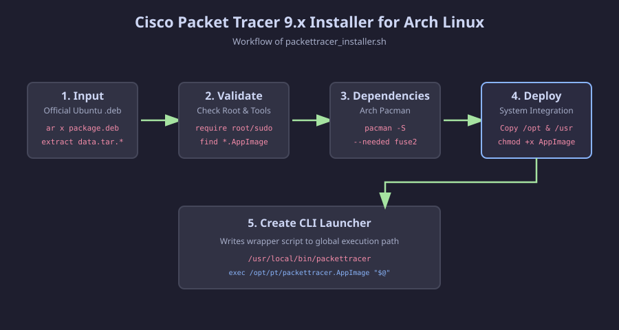

<div align="center">

# Packet Tracer Installer for Arch Linux

**One command to install Cisco Packet Tracer 9.x from the official Ubuntu `.deb` on Arch Linux and Arch-based systems.**




</div>

## Table of contents

- [Why this exists](#why-this-exists)
- [Requirements](#requirements)
- [Quick start](#quick-start)
- [How it works](#how-it-works)
- [Options](#options)
- [Troubleshooting](#troubleshooting)
- [Uninstall](#uninstall)
- [Security notes](#security-notes)
- [Contributing](#contributing) · [License](#license) · [Author](#author)

## Why this exists

Cisco distributes Packet Tracer for Linux only as an Ubuntu `.deb`. Packet Tracer 8.x used a classic Debian file tree, but **9.x ships a single AppImage inside `/opt/pt`**, with no `usr` tree. Scripts written for the old layout check for folders that no longer exist and stop with errors such as `Invalid Packet Tracer file data`.

This installer reads the package, finds the AppImage wherever it is, and installs it with a `packettracer` launcher.

## Requirements

- Arch Linux or an Arch-based distribution (`pacman` available)
- The official `.deb` from your own [Cisco Networking Academy ↗](https://www.netacad.com/) account
- `binutils` (provides `ar`) and `sudo`

## Quick start

```bash
git clone https://github.com/BHAVAN-RBN/PacketTracer-Installer-for-Arch-Linux.git
cd PacketTracer-Installer-for-Arch-Linux

# Optional: see what is inside the package first (no root, installs nothing)
./packettracer_installer.sh --inspect ~/Downloads/CiscoPacketTracer_901_Ubuntu_64bit.deb

# Install
sudo ./packettracer_installer.sh ~/Downloads/CiscoPacketTracer_901_Ubuntu_64bit.deb

# First run, as your normal user, in a terminal: accept the license
packettracer
```

The first run has to happen in a terminal. Packet Tracer asks you to accept Cisco's license there, and no desktop entry exists until that has been done.

## How it works

1. **Input:** unpacks the official `.deb` (`ar x`, then the `data.tar.*` archive) into a temporary directory that is removed when the script exits.
2. **Validate:** checks for root privileges and the required tools, then finds the AppImage inside the package. If there is none, the script prints the package contents and stops before changing anything on your system.
3. **Dependencies:** installs `fuse2` with `pacman`, which AppImages need to run.
4. **Deploy:** copies the package's `/opt` files into place and marks the AppImage executable.
5. **CLI launcher:** creates `/usr/local/bin/packettracer`, a small wrapper that starts the AppImage.

## Options

| Command | Effect |
|---|---|
| `sudo ./packettracer_installer.sh <file.deb>` | Install Packet Tracer |
| `./packettracer_installer.sh --inspect <file.deb>` | List the files inside the package and exit. Needs no root and installs nothing |
| `./packettracer_installer.sh --help` | Show usage |

## Troubleshooting

| Symptom | What to do |
|---|---|
| `No AppImage found in this package` | Run with `--inspect` and open an issue with the output. The package layout may have changed. |
| `Could not unpack data.tar...` | The package uses zstd compression. Install it with `sudo pacman -S zstd` and retry. |
| `Root privileges are required` | Run the install with `sudo`. `--inspect` does not need it. |
| `packettracer: command not found` | Make sure `/usr/local/bin` is in your `PATH` (it is by default on Arch). Open a new terminal. |
| The app does not start | Run `packettracer` in a terminal and read the error. Check that `fuse2` is installed. As a test without FUSE, try `packettracer --appimage-extract-and-run`. |
| The Login button does not open a browser (KDE Plasma 6) | Some users report this because the AppImage's bundled libraries leak into the environment of the browser launcher. Check the comments on the AUR `packettracer` package for workarounds. |

## Uninstall

```bash
sudo rm -rf /opt/pt /usr/local/bin/packettracer
```

Also remove any desktop entries created by the first run.

## Security notes

- **Trust the source.** Only install a `.deb` you downloaded from Cisco yourself. Installing runs code as root.
- **Read the script.** It is short on purpose. Review it before running anything with `sudo`.
- **Look first.** `--inspect` shows the package contents before you commit to an install.

> **Disclaimer.** Cisco Packet Tracer is proprietary software. This project is not affiliated with or endorsed by Cisco, does not distribute Packet Tracer, and requires you to obtain the `.deb` from Cisco yourself under its license.

## Contributing

Issues and pull requests are welcome. If something fails, please include your Arch version, the exact command, the full terminal output, and the output of `--inspect`. Please run `shellcheck packettracer_installer.sh` before opening a pull request.

## License

Released under the [MIT License](LICENSE).
